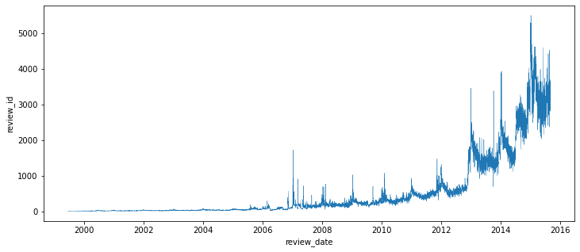
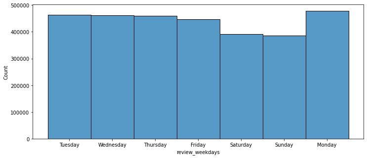
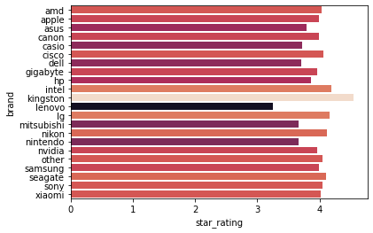
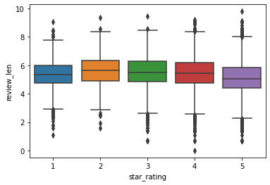
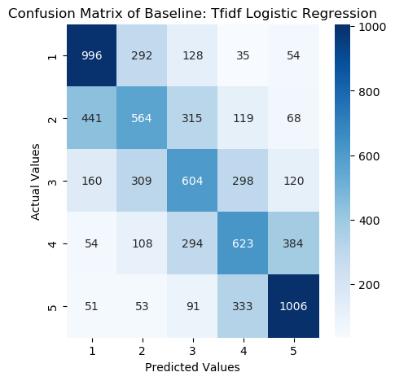
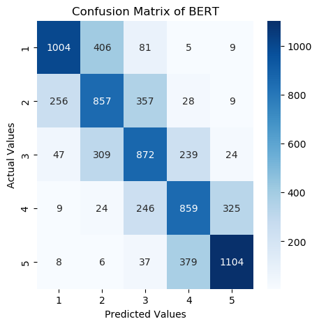

(Detailed methods and results can be found in the source code.)

# Section 1: EDA

Delve into the electronics reviews from the Amazon Reviews Dataset, which comprises 3,091,024 data points.

## Cleaning the data
- Address missing values
- Remove duplicate values
- Filter out irrelevant data

## Univariate Analysis
- Evaluate basic statistics for each feature

It was observed that review ratings lean towards the higher end, whereas helpful and total votes are skewed towards the lower end.
### Review Date

There's a rapid growth in review data, leading to a significant concentration of data points after 2012.

Users tend to write reviews on weekdays compared to weekends.

### Review Word Cloud

## Multivariate Analysis

### Ratings vs. Brands

### Ratings vs. Review Length

It's noticeable that both the lowest and highest ratings typically correspond to shorter review lengths.

# Section 2: Recommender System

**Problem Statement**: For a given user-item pair, how will the user rate this item?

## Similarity Based Model
Utilizing the Jaccard similarity metric, their similarities can be estimated.

**Mean Squared Error**: 1.947

## Latent Factor Model
Through singular value decomposition, latent factors representing each user or item can be discerned.
- with `surprise`

**Mean Squared Error**: 1.689

## Neural Network: Neural Collaborative Filtering
Reference: [Neural Collaborative Filtering](https://arxiv.org/abs/1708.05031)

Leverage neural networks to uncover relationships between users and items.
- with `PyTorch` and `PyTorch Lightning`

**Mean Squared Error**: 0.701

# Section 3: NLP with BERT

**Problem Statement**: Based on the review content, can we predict the rating and determine whether it's positive or negative?

## TF-IDF with Logistic Regression

- with `Sci-Kit Learn`

**Sentiment Accuracy**: 91.95%

### Confusion Matrix

## BERT
Reference: [BERT: Pre-training of Deep Bidirectional Transformers for Language Understanding](https://arxiv.org/abs/1810.04805)

Using the BERT model (part of transformers), and transfer learning techniques.

**Sentiment Accuracy**: 98.34%

### Confusion Matrix

