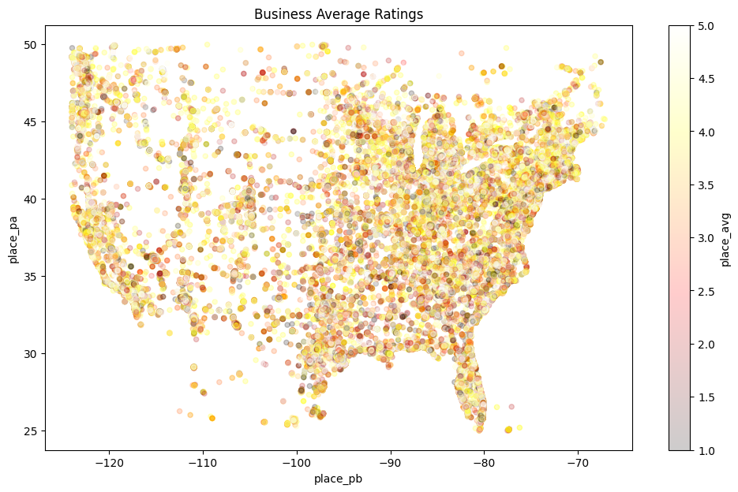

(Detailed methods and results can be found in the source code.)

# EDA

## Business Rating Maps

## Review Word Cloud

# Model Pipeline

Review text data is encoded by [TF-IDF](https://scikit-learn.org/stable/modules/generated/sklearn.feature_extraction.text.TfidfVectorizer.html) and reduced dimensions by PCA.

- Then the data is passed into models: Random Forest and Multi Layer Perceptrons

# Results

## Random Forest
**Test Accuracy Score**: 44.24%

## Multi Layer Perceptrons

**Test Accuracy Score**: 65.37%

