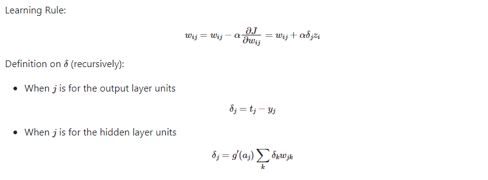

(Detailed implementation can be found in the source code.)

# Implementation

## Back-Propagation
Back propagation is the one of the foundations of modern deep neural network. In this project, back propagation is implemented by following rules:

  

## Activation Functions
Three types of activation functions are implemented: 'sigmoid', 'tanh', 'ReLU'

## Stochastic Gradient Descent

### Early Stopping Mechanism
Evaluate and early stop by validation loss value.

### Cross Entropy Loss
Used for multi-class classification.

## Momentum Method
Using accumulated gradient which can theoretically accelerate the training and avoid local minimum.

## Regularization
Both L1 and L2 regularization method is implemented.

# Performance

## CIFAR-10
Source: [CIFAR10](https://www.cs.toronto.edu/~kriz/cifar-10-python.tar.gz)
**Test Accuracy**: ~50%

## MNIST
Source: [MNIST](https://www.openml.org/search?type=data&status=active&id=554)
**Test Accuracy**: ~97%

# How to Use
1. Copy following files
  - NeuralNet.py
  - Util.py
  - PersonalMLP.py
2. Check this template

  ```python
   import PersonalMLP
   
   # load data 
   X_train = ...
   y_train = ...
   X_test = ...
   y_test = ...
   X_valid = ...
   y_valid = ...
   
   # ensure to normalize the X data, as a requirement of neural network
   
   # configs
   config = personalMLP.Config()
   # check configs
   config()
   # change configs
   config.hyperparameter1 = specific_value
   config.hyperparameter2 = specific_value
   
   # set up the model
   model = PersonalMLP.Model(config)
   
   # train the model
   statistics = model.train(X_train, y_train, X_valid, y_valid)
   
   # use the model to generate predict test
   y_test_pred = model.forward(X_test)
   
   # calculate matrics and demonstrate result
   ```

3. Format of Hyperparameter
  ```python
  layer_specs: [3072, 128, 10]
  activation: tanh
  learning_rate: 0.01
  batch_size: 128
  epochs: 100
  early_stop: True
  early_stop_threshold: 5
  L1_constant: 0
  L2_constant: 0
  momentum: False
  momentum_gamma: 0.9
  ```
