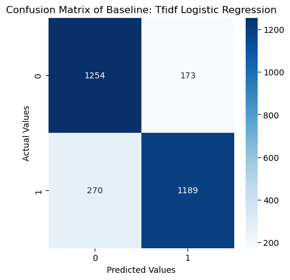
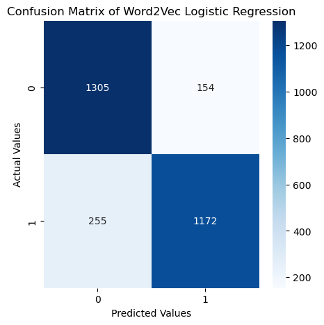
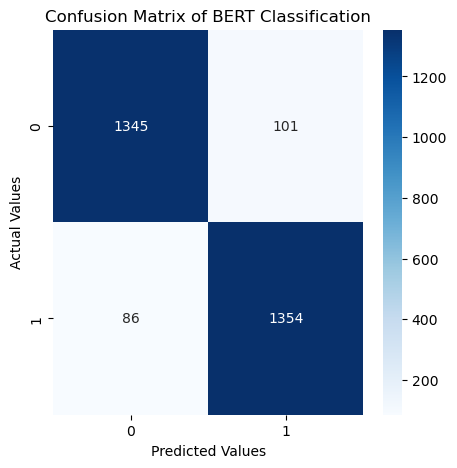
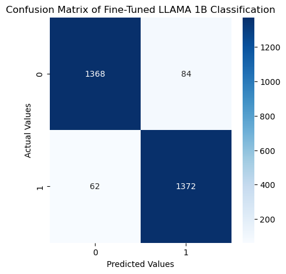

(Detailed methods and results can be found in the source code.)

Constructing...

# Intro
Text classification is a classic NLP task. As different strong & new models being developed, I tried some popular choices of models doing text classification. My ultimate target is testing: is it practical to fine tune a LLM and use it to do text classification on local machine? I test this with toxic comment classification task, which is quite useful in maintaining a healthy internet environment.

# Data
I used the [toxic comment classification chllenge](https://www.kaggle.com/competitions/jigsaw-toxic-comment-classification-challenge) data on kaggle. This dataset is made up with a large number of Wikipedia comments which have been labeled by human raters for toxic behavior. There are many types of toxicity, but for simplicity I only considered the basic `toxic` feature.

Moreover, I only used those English comments as other language comments are too less in amount, and causing the vocabulary size to be too huge. Also as the data is highly imbalanced toward non-toxic data, I balanced the training data by down sampling the negative comments.

# Models

## LSA
The first model I choosed is [tf-idf](https://en.wikipedia.org/wiki/Tf%E2%80%93idf) vectorizer + truncated [SVD](https://en.wikipedia.org/wiki/Singular_value_decomposition) + logistic regression, which is known as latent semantic analysis. This method is very effcient and popular at a relatively early age of NLP. 

## Word2Vec
The second model I choosed is to use classic [word2vec](https://arxiv.org/abs/1301.3781) method developed in 2013 as a very important method of representing words into vectors. For this project specifically, I trained my own Word2Vec embedding. Later I averaged the word embeddings in a sentence (same concept used in deep average network) and feed it into a logistic regression model.

## BERT
After transformer being developed, [BERT](https://arxiv.org/abs/1810.04805) and its variants become the state of the art models for doing text classification tasks. BERT, brief saying, is the encoder part of transformer architecture. I downloaded the pre-trained BERT and fine-tuned it for this task.

## LLAMA 1B with LORA
One specific trend in NLP nowadays is to use one unified model for all types of nlp tasks. But how can we use LLM to do text classification? I pick META's recent release LLAMA 3.2 (September 2024) 1B model, I designed a prompt to ask for direct answer whether a comment is toxic or not. With this prompt, I used the LORA to finetune the model for our task.

# Results
## Performance
|          | Train Acc | Test Acc |
| -------- | --------- | -------- |
| LSA      | 85.44%    | 84.65%   |
| Word2Vec | 86.21%    | 85.83%   |
| BERT     | **96.55%**    | 93.52%   |
| LLAMA 1B | 95.57%    | **94.94%**   |
### Confusion Matrix LSA

### Confusion Matrix Word2Vec

### Confusion Matrix BERT

### Confusion Matrix LLAMA 1B

## Run Time

# Discussion

<!-- # EDA

## Business Rating Maps
Unveil a geographical distribution of business ratings.

## Review Word Cloud
Visual representation of frequently mentioned words in reviews.

# Model Pipeline

We begin by encoding the review text data using [TF-IDF](https://scikit-learn.org/stable/modules/generated/sklearn.feature_extraction.text.TfidfVectorizer.html). This encoded data undergoes dimension reduction through PCA. Subsequently, the transformed data feeds into two different models: Random Forest and Multi-Layer Perceptrons.

# Results

## Random Forest
**Test Accuracy Score**: 44.24%

## Multi Layer Perceptrons

**Test Accuracy Score**: 65.37%

 -->
